## Tomcat

### 1.tomcat系统架构以及原理解析

#### 1.1 浏览器访问服务器流程图

> - **浏览器访问服务器使⽤的是Http协议，Http是应⽤层协议，⽤于定义数据通信的格式，具体的数据传输使⽤的是TCP/IP协议**
>
> - **Tomcat**是⼀个**Http**服务器（能够接收并且处理**http**请求，所以**tomcat**是⼀个**http**服务器）

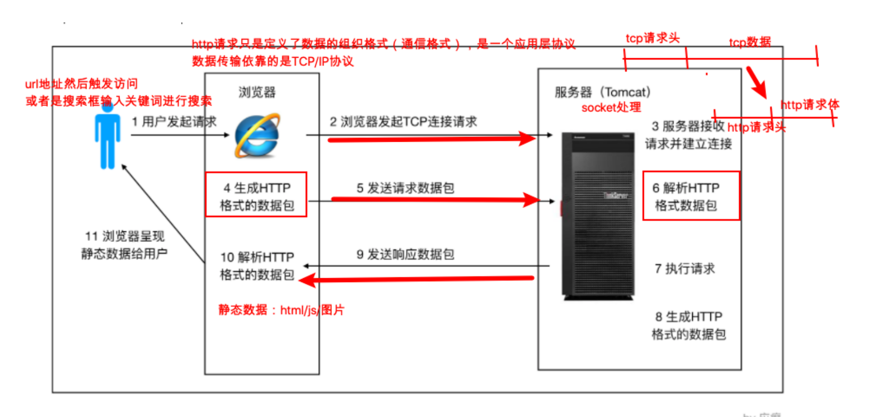

#### **1.2 Tomcat的两个重要身份**

1. http服务器

2. Tomcat是⼀个**Servlet容器**

   

**Tomcat Servlet**容器处理流程

- HTTP服务器会把请求信息使⽤**ServletRequest对象封装起来**

- 进⼀步去调⽤Servlet容器中某个具体的Servlet

- 在 2）中，Servlet容器拿到请求后，根据URL和Servlet的映射关系，**找到相应的Servlet**

- 如果Servlet还没有被加载，就⽤**反射机制**创建这个Servlet，并调⽤Servlet的**init⽅法**来完成初始化

- 接着调⽤这个具体Servlet的**service**⽅法来处理请求，请求处理结果使⽤**ServletResponse**对象封装

- 把ServletResponse对象返回给HTTP服务器，HTTP服务器会把响应发送给客户端

**对应流程图**

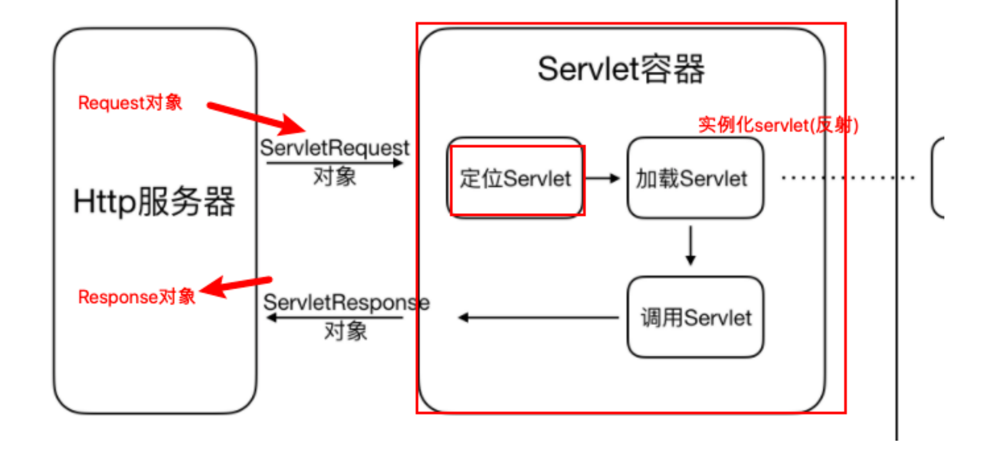

> Tomcat 设计了两个核⼼组件连接器（**Connector**）和容器（**Container**）来完成 Tomcat 的两⼤核⼼功能。

**连接器**，负责对外交流： 处理Socket连接，负责⽹络字节流与Request和Response对象的转化；

**容器**，负责内部处理：加载和管理Servlet，以及具体处理Request请求；


#### 1.3 **Tomcat**连接器组件 **Coyote**

##### 1.3.1 定义和功能

> Coyote 是Tomcat 中**连接器**的组件名称 , **是对外的接⼝**。客户端通过Coyote与服务器建⽴连接、发送请求并接受响应

> 1. Coyote 封装了底层的⽹络通信（Socket 请求及响应处理）
>
> 2. Coyote 使Catalina 容器（容器组件）与具体的请求协议及IO操作⽅式完全解耦
>
> 3. Coyote 将Socket 输⼊转换封装为 Request 对象，进⼀步封装后交由Catalina 容器进⾏处理，处理请求完成后, Catalina 通过Coyote 提供的Response  对象将结果写⼊输出流
>
> 4. Coyote 负责的是具体协议（应⽤层）和**IO**（传输层）相关内容

**数据流:**

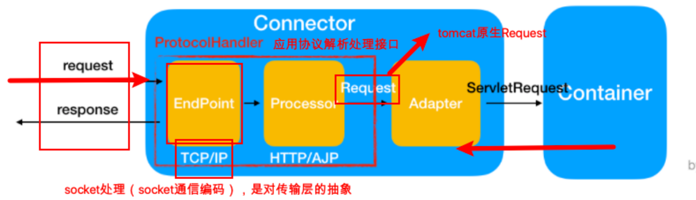

##### 1.3.2 Coyote组成组件及作用

| 组件            | 功能描述                                                     |
| --------------- | ------------------------------------------------------------ |
| EndPoint        | EndPoint 是 Coyote 通信端点，即通信监听的接⼝，**是具体Socket接收和发送处理器**，是对传输层的抽象，因此EndPoint⽤来实现TCP/IP协议的 |
| Processor       | Processor 是Coyote 协议处理接⼝ ，**如果说EndPoint是⽤来实现TCP/IP协议的，那么Processor⽤来实现HTTP协议**，Processor接收来⾃EndPoint的Socket，读取字节流解析成Tomcat Request和Response对象，并通过Adapter将其提交到容器处理，Processor是对应⽤层协议的抽象 |
| ProtocolHandler | Coyote 协议接⼝， 通过Endpoint 和 Processor ， 实现针对具体协议的处理能⼒。Tomcat 按照协议和I/O 提供了6个实现类 ： AjpNioProtocol ，AjpAprProtocol， AjpNio2Protocol ， Http11NioProtocol ，Http11Nio2Protocol ，Http11AprProtocol |
| Adapter         | 由于协议不同，客户端发过来的请求信息也不尽相同，Tomcat定义了⾃⼰的Request类来封装这些请求信息。ProtocolHandler接⼝负责解析请求并⽣成Tomcat Request类。但是这个Request对象不是标准的ServletRequest，不能⽤Tomcat Request作为参数来调⽤容器。Tomcat设计者的解决⽅案是引⼊CoyoteAdapter，**这是适配器模式的经典运⽤**，连接器调⽤CoyoteAdapter的Sevice⽅法，传⼊的是Tomcat Request对象，**CoyoteAdapter负责将Tomcat Request转成ServletRequest**，再调⽤容器 |


### 2.tomcat容器组件catalina

​		Tomcat是⼀个由⼀系列可配置（conf/server.xml）的组件构成的Web容器，**⽽Catalina是Tomcat的servlet容器。**

**Tomcat 本质上就是⼀款 Servlet 容器**， 因为 Catalina 才是 Tomcat 的核⼼ ， 其他模块都是为Catalina 提供⽀撑的。 

⽐如 ：通过 Coyote 模块提供链接通信，Jasper 模块提供 JSP 引擎，Naming 提供JNDI 服务，Juli 提供⽇志服务。

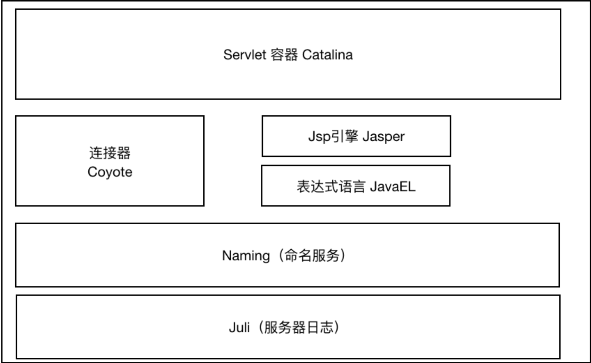


可以认为整个Tomcat就是⼀个Catalina实例，Tomcat 启动的时候会初始化这个实例，Catalina实例通过加载server.xml完成其他实例的创建，创建并管理⼀个Server，Server创建并管理多个服务，每个服务⼜可以有多个Connector和⼀个Container。

>⼀个Catalina实例（容器）
>
>⼀个 Server实例（容器）
>
>多个Service实例（容器）
>
>每⼀个Service实例下可以有多个Connector实例和⼀个Container实例

**定义：**

>**Catalina**
>
>负责解析Tomcat的配置⽂件（server.xml） , 以此来创建服务器Server组件并进⾏管理
>
>**Server**
>
>服务器表示整个Catalina Servlet容器以及其它组件，负责组装并启动Servlaet引擎,Tomcat连接器。Server通过实现Lifecycle接⼝，提供了⼀种优雅的启动和关闭整个系统的⽅式
>
>**Service**
>
>服务是Server内部的组件，⼀个Server包含多个Service。它将若⼲个Connector组件绑定到⼀个Container
>
>**Container**
>
>容器，负责处理⽤户的servlet请求，并返回对象给web⽤户的模块

**Container** 组件的具体结构

Container组件下有⼏种具体的组件，分别是E**ngine、Host、Context和Wrapper**。这4种组件（容器）

是⽗⼦关系。Tomcat通过⼀种分层的架构，使得Servlet容器具有很好的灵活性。

- Engine

> 表示整个Catalina的Servlet引擎，⽤来管理多个虚拟站点，⼀**个Service最多只能有⼀个Engine，但是⼀个引擎可包含多个Host**

- Host

> 代表⼀个虚拟主机，或者说⼀个站点，可以给Tomcat配置多个虚拟主机地址，**⽽⼀个虚拟主机下可包含多个Context**

- Context

> 表示⼀个Web应⽤程序， **⼀个Web应⽤可包含多个Wrapper**

- Wrapper

> 表示⼀个Servlet，Wrapper 作为容器中的最底层，**不能包含⼦容器**

上述组件的配置其实就体现在**conf/server.xml**中。


### 3.Tomcat服务器核心配置详解（server.xml）

server.xml文件结构

```xml
<!--
Server 根元素，创建⼀个Server实例，⼦标签有 Listener、GlobalNamingResources、
Service
-->
<Server>
  <!--定义监听器-->
  <Listener/>
  <!--定义服务器的全局JNDI资源 -->
  <GlobalNamingResources/>
  <!--
  定义⼀个Service服务，⼀个Server标签可以有多个Service服务实例
  -->
  <Service/>
</Server>
```


#### 3.1 Server标签

```xml
<!--
port：关闭服务器的监听端⼝
shutdown：关闭服务器的指令字符串
-->
<Server port="8005" shutdown="SHUTDOWN">
  <!--在启动的时候打印jvm 操作系统及服务器信息-->
  <Listener className="org.apache.catalina.startup.VersionLoggerListener" />
  <!-- 加载（服务器启动） 和 销毁 （服务器停⽌）APR。如果找不到APR库,则会输出⽇志,并不影响 Tomcat启动 -->
  <Listener className="org.apache.catalina.core.AprLifecycleListener" SSLEngine="on" />
  <!-- 避免JRE内存泄漏问题 -->
  <Listener className="org.apache.catalina.core.JreMemoryLeakPreventionListener" />
  <!-- 加载（服务器启动）和 销毁(服务器停⽌)全局命名服务 -->
  <Listener className="org.apache.catalina.mbeans.GlobalResourcesLifecycleListener" />
  <!-- 在Context停⽌时重建 Executor 池中的线程,以避免ThreadLocal 相关的内存泄漏 -->
  <Listener className="org.apache.catalina.core.ThreadLocalLeakPreventionListener" />
  
  <!-- GlobalNamingResources 中定义了全局命名服务-->
  <GlobalNamingResources>
    <Resource name="UserDatabase" auth="Container"
              type="org.apache.catalina.UserDatabase"
              description="User database that can be updated and saved"
              factory="org.apache.catalina.users.MemoryUserDatabaseFactory"
              pathname="conf/tomcat-users.xml" />
  </GlobalNamingResources>
  ……
</Server>
```

#### 3.2 Service标签

```xml
<!--
该标签⽤于创建 Service 实例，默认使⽤ org.apache.catalina.core.StandardService。
默认情况下，Tomcat 仅指定了Service 的名称， 值为 "Catalina"。
Service ⼦标签为 ： Listener、Executor、Connector、Engine，
其中：
Listener ⽤于为Service添加⽣命周期监听器，默认没有，不常用
Executor ⽤于配置Service 共享线程池，
Connector ⽤于配置Service 包含的链接器，
Engine ⽤于配置Service中链接器对应的Servlet 容器引擎
-->
<Service name="Catalina">
...
</Service>
```


#### 3.3 **Executor** 标签 & Connector 标签

```xml
<!--
Connector 标签
Connector 标签⽤于创建链接器实例
默认情况下，server.xml 配置了两个链接器，⼀个⽀持HTTP协议，⼀个⽀持AJP协议
⼤多数情况下，我们并不需要新增链接器配置，只是根据需要对已有链接器进⾏优化
默认情况下，Service 并未添加共享线程池配置。 如果我们想添加⼀个线程池， 可以在
<Service> 下添加如下配置：
name：线程池名称，⽤于 Connector中指定
namePrefix：所创建的每个线程的名称前缀，⼀个单独的线程名称为
namePrefix+threadNumber
maxThreads：池中最⼤线程数
minSpareThreads：活跃线程数，也就是核⼼池线程数，这些线程不会被销毁，会⼀直存在
maxIdleTime：线程空闲时间，超过该时间后，空闲线程会被销毁，默认值为6000（1分钟），单位
毫秒
maxQueueSize：在被执⾏前最⼤线程排队数⽬，默认为Int的最⼤值，也就是⼴义的⽆限。除⾮特
殊情况，这个值 不需要更改，否则会有请求不会被处理的情况发⽣
prestartminSpareThreads：启动线程池时是否启动 minSpareThreads部分线程。默认值为
false，即不启动
threadPriority：线程池中线程优先级，默认值为5，值从1到10
className：线程池实现类，未指定情况下，默认实现类为
org.apache.catalina.core.StandardThreadExecutor。如果想使⽤⾃定义线程池⾸先需要实现
org.apache.catalina.Executor接⼝
-->
<Executor name="commonThreadPool"
namePrefix="thread-exec-"
maxThreads="200"
minSpareThreads="100"
maxIdleTime="60000"
maxQueueSize="Integer.MAX_VALUE"
prestartminSpareThreads="false"
threadPriority="5"
className="org.apache.catalina.core.StandardThreadExecutor"/>
```

**Connector** （默认配置）

```xml
<!--
port：端⼝号，Connector ⽤于创建服务端Socket 并进⾏监听， 以等待客户端请求链接。如果该属性设置
为0， Tomcat将会随机选择⼀个可⽤的端⼝号给当前Connector 使⽤

protocol：当前Connector ⽀持的访问协议。 默认为 HTTP/1.1 ， 并采⽤⾃动切换机制选择⼀个基于 JAVA
NIO 的链接器或者基于本地APR的链接器（根据本地是否含有Tomcat的本地库判定）

connectionTimeOut:Connector 接收链接后的等待超时时间， 单位为 毫秒。 -1 表示不超时。
redirectPort：当前Connector 不⽀持SSL请求， 接收到了⼀个请求， 并且也符合security-constraint 约束，
需要SSL传输，Catalina⾃动将请求重定向到指定的端⼝。
executor：指定共享线程池的名称， 也可以通过maxThreads、minSpareThreads 等属性配置内部线程池。
可以使⽤共享线程池

Engine 标签
Engine 表示 Servlet 引擎
Host 标签
Host 标签⽤于配置⼀个虚拟主机
URIEncoding:
⽤于指定编码URI的字符编码， Tomcat8.x版本默认的编码为 UTF-8 , Tomcat7.x版本默认为ISO-
8859-1
-->
<!--org.apache.coyote.http11.Http11NioProtocol ， ⾮阻塞式 Java NIO 链接器-->
<Connector port="8080" protocol="HTTP/1.1" connectionTimeout="20000"
redirectPort="8443" />
<Connector port="8009" protocol="AJP/1.3" redirectPort="8443" />
```

**Connector 详尽配置**

```xml
<Connector port="8080"
protocol="HTTP/1.1"
//配置共享线程池
executor="commonThreadPool"
//如果不使用共享线程池的话Connector可以创建自己的线程池。
//一般不单独配置，如果多个connector都有自己的独有线程池会造成资源浪费。一般用共享线程池
maxThreads="1000"
minSpareThreads="100"
//下面两项一般跟线程池数保持一致
acceptCount="1000"
maxConnections="1000"
//请求超时时间
connectionTimeout="20000"
//是否启用压缩
compression="on"
//最小压缩阈值。低于这个值就不进行压缩
compressionMinSize="2048"
//上传请求的话不启用超时时间
disableUploadTimeout="true"
redirectPort="8443"
//url编码格式
URIEncoding="UTF-8" />
```


#### 3.4 **Engine** 标签 & **Host** 标签 & **Context** 标签

Engine 表示 Servlet 引擎

```xml
<!--
name： ⽤于指定Engine 的名称， 默认为Catalina
defaultHost：默认使⽤的虚拟主机名称， 当客户端请求指向的主机⽆效时， 将交由默认的虚拟主机处
理， 默认为localhost 对应engine标签下的host的name。
-->
<Engine name="Catalina" defaultHost="localhost">
...
</Engine>
```

Host 标签⽤于配置⼀个虚拟主机

```xml
<!--appBase:基础目录-->
<!--unpackWARs:解压war包-->
<!--autoDeploy:自动部署-->
<Host name="localhost" appBase="webapps" unpackWARs="true" autoDeploy="true">
 ...
</Host>
```

Context 标签⽤于配置⼀个Web应⽤，如下：

```xml
<Host name="www.abc.com" appBase="webapps" unpackWARs="true" autoDeploy="true">
<!--
docBase：Web应⽤⽬录或者War包的部署路径。可以是绝对路径，也可以是相对于 Host appBase的
相对路径。
path：Web应⽤的Context 路径。如果我们Host名为localhost， 则该web应⽤访问的根路径为：
 http://localhost:8080/web3。
-->
<Context docBase="/Users/yingdian/web_demo" path="/web3"></Context> 
</Host>
```


### 4.Tomcat源代码剖析


#### 4.1 tomcat启动流程图

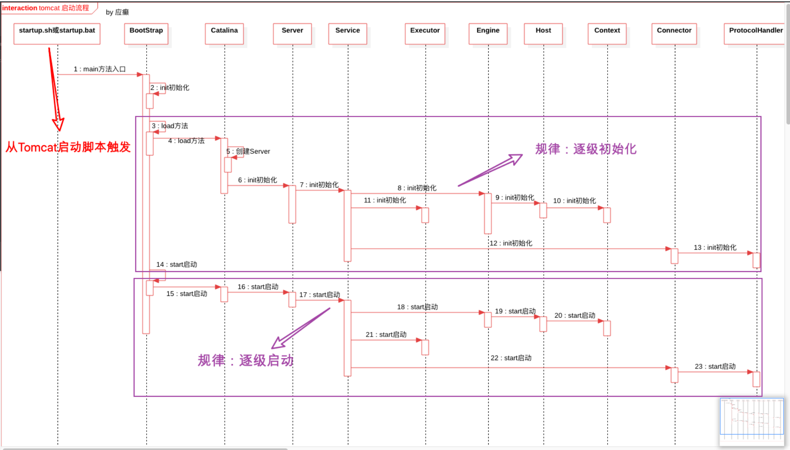


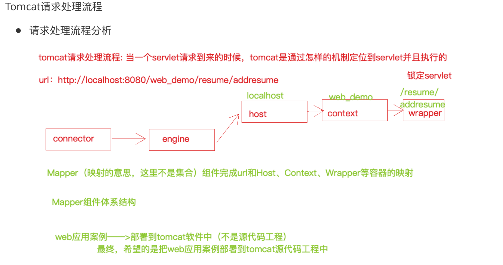


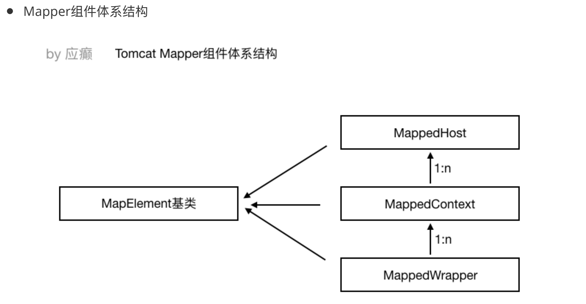

### 5.Tomcat类加载机制

> 类加载器（ClassLoader，说⽩了也是⼀个类，jvm启动的时候先把类加载器读取到内存当中去，其他的类（⽐如各种jar中的字节码⽂件，⾃⼰开发的代码编译之后的.class⽂件等等））
>
> 要说 Tomcat 的类加载机制，⾸先需要来看看 Jvm 的类加载机制，因为 Tomcat 类加载机制是在 Jvm 类加载机制基础之上进⾏了⼀些变动。

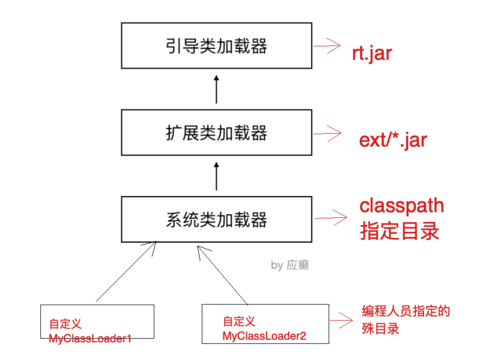

| 类加载器                                     | 作⽤                                                         |
| -------------------------------------------- | ------------------------------------------------------------ |
| 引导启动类加载器BootstrapClassLoader         | c++编写，加载java核⼼库 java.*,⽐如rt.jar中的类，构造ExtClassLoader和AppClassLoader |
| 扩展类加载器 ExtClassLoader                  | java编写，加载扩展库 JAVA_HOME/lib/ext⽬录下的jar中的类，如classpath中的jre ，javax.*或者java.ext.dir指定位置中的类 |
| 系统类加载器SystemClassLoader/AppClassLoader | 默认的类加载器，搜索环境变量 classpath 中指明的路径          |

当JVM运⾏过程中，⽤户⾃定义了类加载器去加载某些类时，会按照下⾯的步骤（⽗类委托机制）　　

- ⽤户⾃⼰的类加载器，把加载请求传给⽗加载器，⽗加载器再传给其⽗加载器，⼀直到加载器树的顶层

- 最顶层的类加载器⾸先针对其特定的位置加载，如果加载不到就转交给⼦类

- **如果⼀直到底层的类加载都没有加载到**，**那么就会抛出异常ClassNotFoundException** 

  因此，按照这个过程可以想到，如果同样在classpath指定的⽬录中和⾃⼰⼯作⽬录中存放相同的class，**会优先加载classpath⽬录中的⽂件**


#### 5.1 双亲委派机制

定义：

>某个类加载器需要加载某个.class⽂件时，⾸先把这个任务委托给他的上级类加载器，递归这个操作，如果上级的类加载器没有加载，⾃⼰才会去加载这个类。

作用：

>- 防⽌重复加载同⼀个.class。通过委托去向上⾯问⼀问，加载过了，就不⽤再加载⼀遍。保证数据安全。
>- 保证核⼼.class不能被篡改。通过委托⽅式，不会去篡改核⼼.class，即使篡改也不会去加载，即使加载也不会是同⼀个.class对象了。不同的加载器加载同⼀个.class也不是同⼀个.class对象。这样保证了class执⾏安全（如果⼦类加载器先加载，那么我们可以写⼀些与java.lang包中基础类同名的类，然后再定义⼀个⼦类加载器，这样整个应⽤使⽤的基础类就都变成我们⾃⼰定义的类了。）

#### 5.2 Tomcat的类加载器

Tomcat的类加载机制相对于Jvm的类加载机制做了⼀些改变。**没有严格的遵从双亲委派机制**，也可以说打破了双亲委派机制

⽐如：有⼀个tomcat，webapps下部署了两个应⽤
app1/lib/a-1.0.jarcom.lagou.edu.Abc 
app2/lib/a-2.0.jarcom.lagou.edu.Abc 
不同版本中Abc类的内容是不同的，**代码是不⼀样的**

tomcat的处理方法：

- 引导类加载器和扩展类加载器的作⽤不变

- 系统类加载器正常情况下加载的是CLASSPATH下的类，但是Tomcat的启动脚本并未使⽤该变量，⽽是加载tomcat启动的类，⽐如bootstrap.jar，通常在catalina.bat或者catalina.sh中指定。位于CATALINA_HOME/bin下

- Common通⽤类加载器加载Tomcat使⽤以及应⽤通⽤的⼀些类，位于CATALINA_HOME/lib下，⽐如servlet-api.jar 

- CatalinaClassLoader⽤于加载服务器内部可⻅类，这些类应⽤程序不能访问

- SharedClassLoader⽤于加载应⽤程序共享类，这些类服务器不会依赖

- WebappClassLoader，**每个应⽤程序都会有⼀个独⼀⽆⼆的WebappClassLoader**，他⽤来加载本应⽤程序/WEB-INF/classes和/WEB-INF/lib下的类。
  **tomcat8.5默认改变了严格的双亲委派机制**

  > 1. ⾸先从BootstrapClassloader加载指定的类
  >
  > 2. 如果未加载到，则从/WEB-INF/classes加载
  >
  > 3. 如果未加载到，则从/WEB-INF/lib/*.jar加载
  > 4. 如果未加载到，则依次从System、Common、Shared加载（在这最后⼀步，遵从双亲委派机制）


### 6.Tomcat 对https的支持

#### 6.1 HTTPS和HTTP的主要区别

- HTTPS协议使⽤时需要到电⼦商务认证授权机构（CA）申请SSL证书 （ca证书）
- HTTP默认使⽤8080端⼝，**HTTPS默认使⽤8443端⼝**
- HTTPS则是具有SSL加密的安全性传输协议，对数据的传输进⾏加密，效果上相当于HTTP的升级版
- HTTP的连接是⽆状态的，不安全的；**HTTPS协议是由SSL+HTTP协议构建的可进⾏加密传输、身份认证的⽹络协议，⽐HTTP协议安全**

**HTTPS工作原理（流程）：**

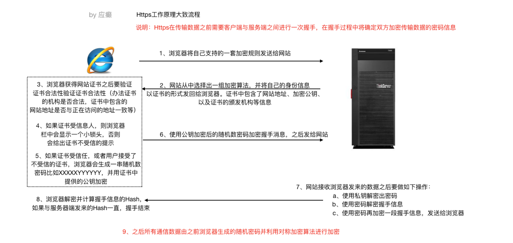

#### 6.2 Tomcat配置https

1. 使⽤JDK中的keytool⼯具⽣成免费的秘钥库⽂件(证书)

```shell
keytool -genkey -alias lagou -keyalg RSA -keystore lagou.keystore
```

2. 配置conf/server.xml

```xml
<Connector port="8443" protocol="org.apache.coyote.http11.Http11NioProtocol"
maxThreads="150" schema="https" secure="true" SSLEnabled="true"> 
  <SSLHostConfig> 
    <Certificate certificateKeystoreFile="/Users/yingdian/workspace/servers/apache-tomcat-
		8.5.50/conf/lagou.keystore" certificateKeystorePassword="lagou123" type="RSA"/>
	</SSLHostConfig>
</Connector>
```


### 7.Tomcat 优化

Tomcat优化从两个⽅⾯进⾏

- JVM虚拟机优化（优化内存模型）

- Tomcat⾃身配置的优化（⽐如是否使⽤了共享线程池？IO模型？）


#### 7.1 jvm运行配置优化

##### 7.1.1  jvm内存调优

jvm的优化主要从**内存调优**和**垃圾回收机制**两个方面进行：

1. 内存直接影响服务的运⾏效率和吞吐量
2. 垃圾回收机制会不同程度地导致程序运⾏中断（垃圾回收策略不同，垃圾回收次数和回收效率都是不同的）

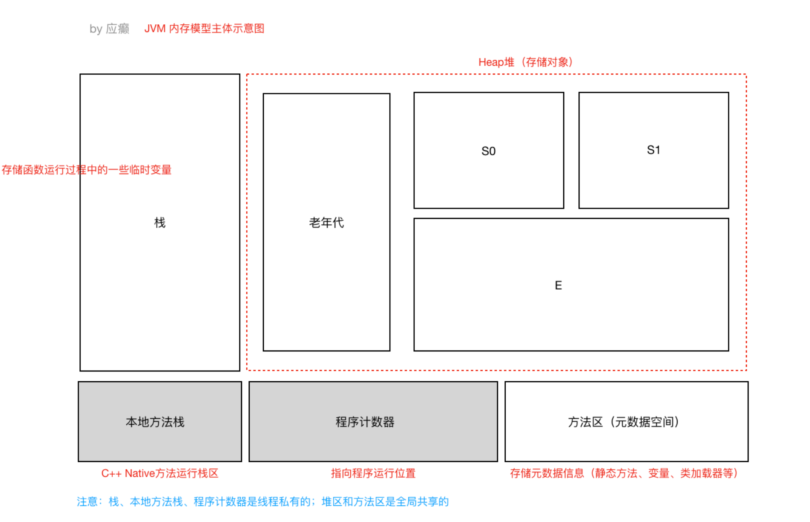


**jvm虚拟机相关的内存配置**


| 参数                  | 参数作用                                          | 优化建议                      |
| --------------------- | ------------------------------------------------- | ----------------------------- |
| -server               | 启动Server，以服务器模式运行                      | 建议以服务器模式运行          |
| -Xms                  | 最小堆内存                                        | 建议与-Xmx设置相同            |
| -Xmx                  | 最⼤堆内存                                        | 建议设置为服务器可⽤内存的80% |
| -XX:MetaspaceSize     | 元空间初始值                                      |                               |
| \-XX:MaxMetaspaceSize | 元空间最⼤内存                                    | 默认⽆限                      |
| -XX:NewRatio          | 年轻代和⽼年代⼤⼩⽐值，取值为整数，默认为2       | 不需要修改                    |
| -XX:SurvivorRatio     | Eden区与Survivor区⼤⼩的⽐值，取值为整数，默认为8 | 不需要修改                    |


示例：

```properties
JAVA_OPTS="-server -Xms2048m -Xmx2048m -XX:MetaspaceSize=256m -XX:MaxMetaspaceSize=512m"
```


##### 7.1.2 jvm垃圾回收策略（GC）

**垃圾回收性能指标**

- **吞吐量**：⼯作时间（排除GC时间）占总时间的百分⽐， ⼯作时间并不仅是程序运⾏的时间，还包含内存分配时间。

- **暂停时间**：由垃圾回收导致的应⽤程序停⽌响应次数/时间。

  

**垃圾收集器分类：**

- **串⾏收集器（Serial Collector）**

> 单线程执⾏所有的垃圾回收⼯作， 适⽤于**单核CPU**服务器
>
> ⼯作进程 **-----|**（单线程）垃圾回收线程进⾏垃圾收集 **|---**⼯作进程继续


- **并⾏收集器（Parallel Collector）**

>⼯作进程**-----|**（多线程）垃圾回收线程进⾏垃圾收集**|---**⼯作进程继续
>
>⼜称为**吞吐量收集器（关注吞吐量）**， 以并⾏的⽅式执⾏年轻代的垃圾回收， 该⽅式可以显著降低垃圾回收的开销(指多条垃圾收集线程并⾏⼯作，但此时⽤户线程**仍然处于等待状态**)。适⽤于**多处理器或多线程硬件上**运⾏的**数据量较⼤**的应⽤


- **并发收集器（Concurrent Collector）**

>以并发的⽅式执⾏⼤部分垃圾回收⼯作，以缩短垃圾回收的暂停时间。**适⽤于那些响应时间优先于吞吐量的应⽤**， 因为该收集器虽然最⼩化了暂停时间(指⽤户线程与垃圾收集线程同时执⾏,但不⼀定是并⾏的，可能会交替进⾏)， **但是会降低应⽤程序的性能**


- **CMS收集器（Concurrent Mark Sweep Collector）**

>**并发标记**清除收集器， 适⽤于那些更愿意缩短垃圾回收暂停时间**并且**负担的起与垃圾回收共享处理器资源的应⽤


- **G1收集器（Garbage-First Garbage Collector)**

>适⽤于**⼤容量内存的多核**服务器， 可以在满⾜垃圾回收暂停时间⽬标的同时， 以最⼤可能性实现⾼吞吐量**(JDK1.7之后)**


**垃圾回收收集器参数**

| 参数                           | 说明                                                         |
| ------------------------------ | ------------------------------------------------------------ |
| -XX:+UseSerialGC               | 启⽤串⾏收集器                                               |
| -XX:+UseParallelGC             | 启⽤并⾏垃圾收集器，配置了该选项，那么 -XX:+UseParallelOldGC默认启⽤ |
| -XX:+UseParNewGC               | 年轻代采⽤并⾏收集器，如果设置了 -XX:+UseConcMarkSweepGC选项，⾃动启⽤ |
| -XX:ParallelGCThreads          | 年轻代及⽼年代垃圾回收使⽤的线程数。默认值依赖于JVM使⽤的CPU个 数 |
| -XX:+UseConcMarkSweepGC（CMS） | 对于⽼年代，启⽤CMS垃圾收集器。 当并⾏收集器⽆法满⾜应⽤的延迟需求，推荐使⽤CMS或G1收集器。启⽤该选项后， -XX:+UseParNewGC⾃动启⽤。 |
| -XX:+UseG1GC                   | 启⽤G1收集器。 G1是服务器类型的收集器， ⽤于多核、⼤内存的机器。它在保持⾼吞吐量的情况下，⾼概率满⾜GC暂停时间的⽬标。 |

**示例配置：**

```shell
JAVA_OPTS="-XX:+UseConcMarkSweepGC"
```


#### 7.2 Tomcat配置调优

- 共享线程池
- 最大连接数
- 禁用ajp
- 调整io模式
-  动静分离

##### 7.2.1 共享线程池

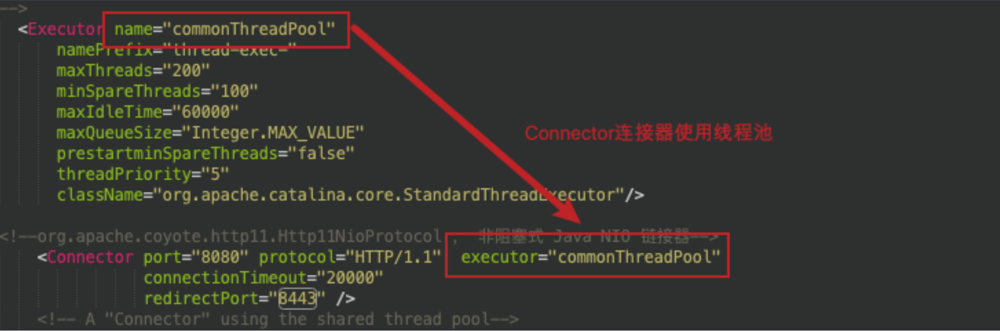


##### **7.2.2 最大连接数**

调整tomcat/conf/server.xml 中关于链接器的配置可以提升应⽤服务器的性能。

| 参数           | 说明                                                         |
| -------------- | ------------------------------------------------------------ |
| maxConnections | 最⼤连接数，当到达该值后，服务器**接收但不会处理**更多的请求， 额外的请求将会阻塞直到连接数低于maxConnections 。可通过**ulimit -a** 查看服务器限制。**对于CPU要求更⾼(计算密集型)时，建议不要配置过⼤** ; 对于CPU要求不是特别⾼时，建议配置在2000左右(受服务器性能影响)。 当然这个需要服务器硬件的⽀持 |
| maxThreads     | 最⼤线程数,需要根据服务器的硬件情况，进⾏⼀个合理的设置      |
| acceptCount    | 最⼤排队等待数,当服务器接收的请求数量到达maxConnections ，此时Tomcat会将后⾯的请求，存放在任务队列中进⾏排序， **acceptCount指的就是任务队列中排队等待的请求数 。** ⼀台Tomcat的最⼤的请求处理数量，是**maxConnections+acceptCount** |

##### 7.2.3 禁用ajp

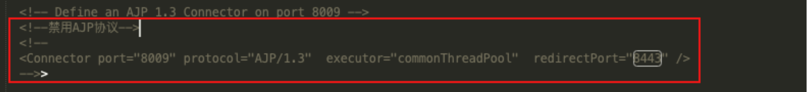


##### 7.2.4 调整io

Tomcat8之前的版本默认使⽤BIO（阻塞式IO），对于每⼀个请求都要创建⼀个线程来处理，不适合⾼并发；Tomcat8以后的版本默认使⽤NIO模式（⾮阻塞式IO）

当Tomcat并发性能有较⾼要求或者出现瓶颈时，我们可以尝试使⽤APR模式，APR（Apache PortableRuntime）是从**操作系统级别**解决异步IO问题，使⽤时需要在操作系统上**安装APR和Native**（因为APR原理是使⽤使⽤JNI技术调⽤操作系统底层的IO接⼝）


##### 7.2.5 动静分离

可以使⽤Nginx+Tomcat相结合的部署⽅案，**Nginx负责静态资源访问，Tomcat负责Jsp等动态资源访问处理**（因为Tomcat不擅⻓处理静态资源）。


## Nginx

### 1.简介

Nginx 是⼀个**⾼性能的HTTP**和**反向代理web**服务器，核⼼特点是占有**内存少，并发能⼒强**

#### 1.1 应用场景：

- **Http服务器（Web服务器）**

> 性能⾮常⾼，⾮常注重效率，能够经受⾼负载的考验。
>
> ⽀持50000个并发连接数，不仅如此，CPU和内存的占⽤也⾮常的低，10000个没有活动的连接才占⽤2.5M的内存。

- **反向代理服务器**

> 正向代理:
>
> 在浏览器中配置代理服务器的相关信息，通过代理服务器访问⽬标⽹站，代理服务器收到⽬标⽹站的响应之后，会把响应信息返回给我们⾃⼰的浏览器客户端
>
> 反向代理:
>
> 浏览器客户端发送请求到反向代理服务器（⽐如Nginx），由反向代理服务器选择原始服务器提供服务获取结果响应，最终再返回给客户端浏览器
>
> 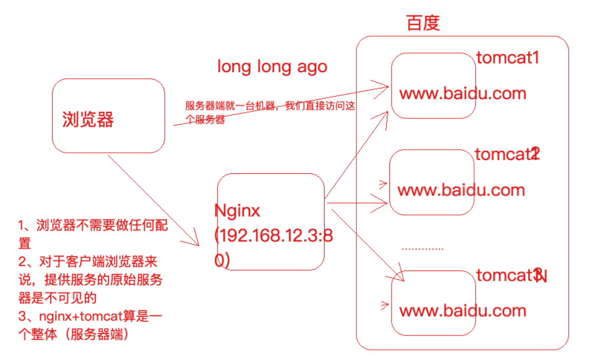


- **负载均衡服务器**

负载均衡，当⼀个请求到来的时候（结合上图），Nginx反向代理服务器根据请求去找到⼀个原始服务器来处理当前请求，那么这叫做**反向代理**。那么，如果⽬标服务器有多台（⽐如上图中的tomcat1，tomcat2，tomcat3...），**找哪⼀个⽬标服务器来处理当前请求呢，这样⼀个寻找确定的过程就叫做负载均衡**。⽣活中也有很多这样的例⼦，⽐如，我们去银⾏，可以处理业务的窗⼝有多个，那么我们会被分配到哪个窗⼝呢到底，这样的⼀个过程就叫做负载均衡。负载均衡就是为了**解决⾼负载**的问题。


- **动静分离**

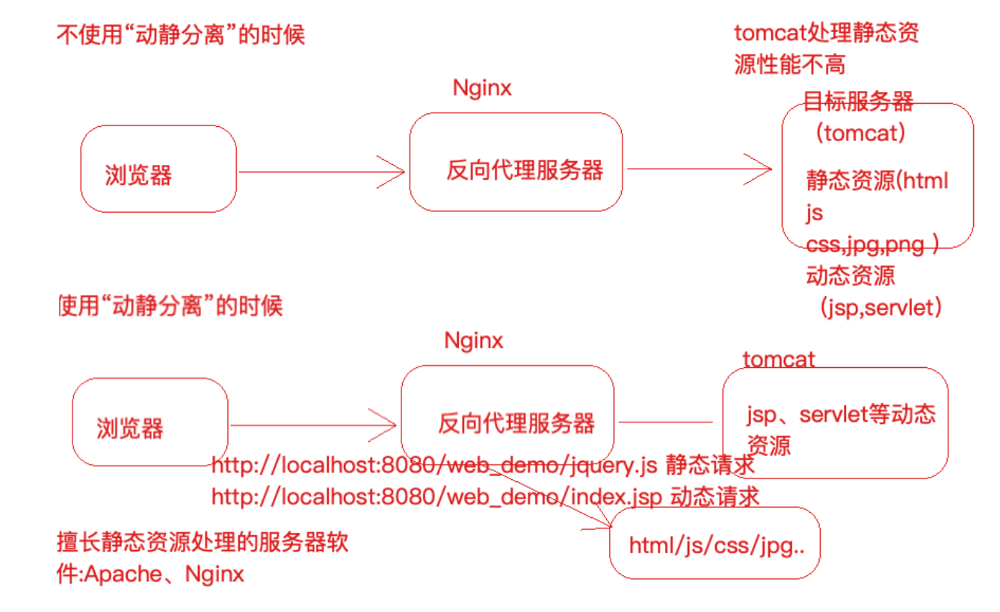

#### 1.2  **Nginx**核⼼配置⽂件解读

Nginx的核⼼配置⽂件conf/nginx.conf包含三块内容：全局块、events块、http块

>- **全局块**
>
>从配置⽂件开始到events块之间的内容，此处的配置影响nginx服务器整体的运⾏，⽐如worker进
>
>程的数量、错误⽇志的位置等
>
>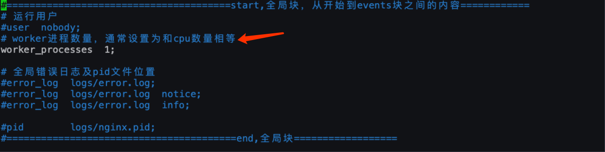
>
>- **events块**
>
>events块主要影响nginx服务器与⽤户的⽹络连接，⽐如worker_connections 1024，标识每个workderprocess⽀持的最⼤连接数为1024
>
>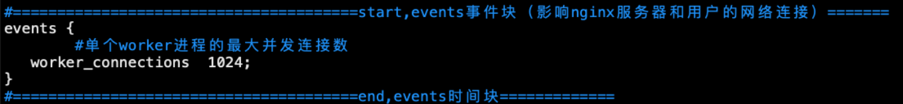
>
>- **http块(主要配置)**
>
>http块是配置最频繁的部分，虚拟主机的配置，监听端⼝的配置，请求转发、反向代理、负载均衡等


#### 1.3 Nginx安装步骤

>上传nginx安装包到linux服务器，nginx安装包(.tar⽂件)下载地址：http://nginx.org
>
>1. 安装Nginx依赖，pcre、openssl、gcc、zlib（推荐使⽤yum源⾃动安装）
>
>   yum -y install gcc zlib zlib-devel pcre-devel openssl openssl-devel
>
>2. 解包Nginx软件包 tar -xvf nginx-1.17.8.tar
>
>3. 进⼊解压之后的⽬录 nginx-1.17.8
>
>4. cd nginx-1.17.8
>
>5. 命令⾏执⾏./confifigure
>
>6. 命令⾏执⾏ make
>
>7. 命令⾏执⾏ make install，完毕之后在/usr/local/下会产⽣⼀个nginx⽬录
>8. 进⼊sbin⽬录中，执⾏启动nginx命令 
>
>```shell
>cd nginx/sbin
>./nginx
>```
>
>9. 然后访问服务器的80端⼝（nginx默认监听80端⼝）

**Nginx启停命令**

>./nginx 启动nginx
>
>./nginx -s stop 终⽌nginx（当然也可以找到nginx进程号，然后使⽤kill -9 杀掉nginx进程）
>
>./nginx -s reload (重新加载nginx.conf配置⽂件)

#### 1.4 Nginx反向代理配置

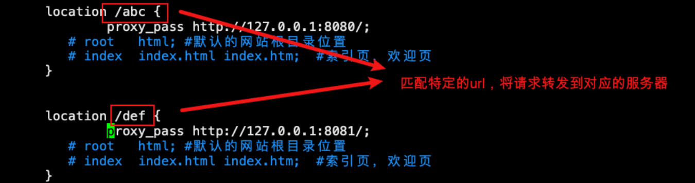

这⾥主要就是多**location**的使⽤，这⾥的**nginx**中**server/location**就好⽐**tomcat**中的**Host/Context**

```shell
location [=|~|~*|^~] /uri/ { … }
```

在nginx配置⽂件中，location主要有这⼏种形式：

- 正则匹配 location ~ /lagou { }

- 不区分⼤⼩写的正则匹配 location ~* /lagou { }

- 匹配路径的前缀 location ^~ /lagou { }

- 精确匹配 location = /lagou { }

- 普通路径前缀匹配 location /lagou { }

优先级.   **4 > 3 > 2 > 1 > 5**


#### 1.5 Nginx负载均衡配置

需求：

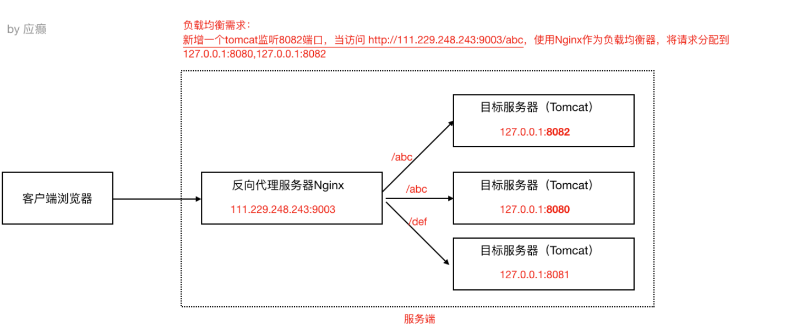

**Nginx负载均衡策略:**

- 轮询

> 默认策略，每个请求按时间顺序逐⼀分配到不同的服务器，如果某⼀个服务器下线，能⾃动剔除

```json
upstream lagouServer{
  server 111.229.248.243:8080;
  server 111.229.248.243:8082;
}
location /abc {
  proxy_pass http://lagouServer/;
}
```

- 权重

> weight代表权重，默认每⼀个负载的服务器都为1，权重越⾼那么被分配的请求越多（**⽤于服务器性能不均衡的场景**）

```json
upstream lagouServer{
  server 111.229.248.243:8080 weight=1;
  server 111.229.248.243:8082 weight=2; 
}
```

- Ip-hash

> 每个请求按照ip的hash结果分配，每⼀个客户端的请求会固定分配到同⼀个⽬标服务器处理，**可以解决session问题**

```json
upstream lagouServer{
    ip_hash;
    server 111.229.248.243:8080;
    server 111.229.248.243:8082;
}
```


#### 1.6 动静分离

动静分离就是讲动态资源和静态资源的请求处理分配到不同的服务器上，⽐较经典的组合就是**Nginx+Tomcat**架构（**Nginx处理静态资源请求，Tomcat处理动态资源请求**），那么其实之前的讲解中，Nginx反向代理⽬标服务器Tomcat，我们能看到⽬标服务器ROOT项⽬的index.jsp，这本身就是Tomcat在处理动态资源请求了。

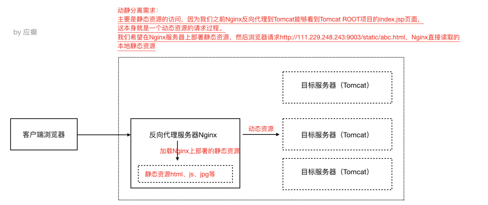

配置：

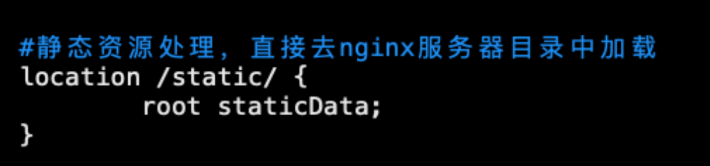

